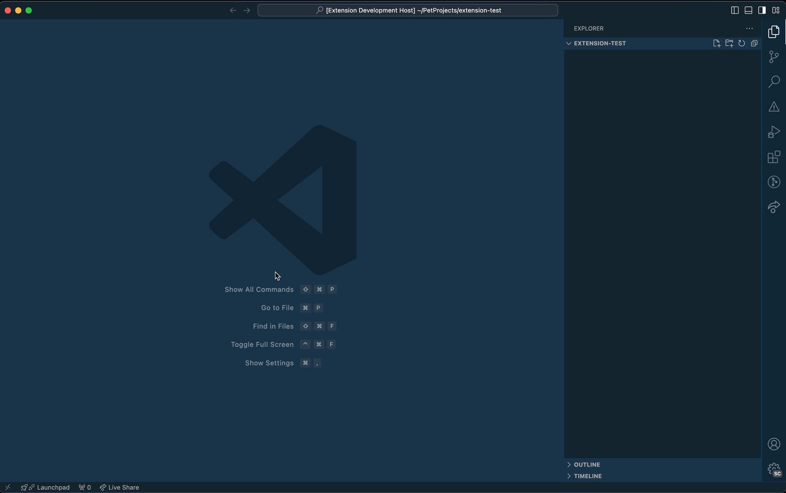
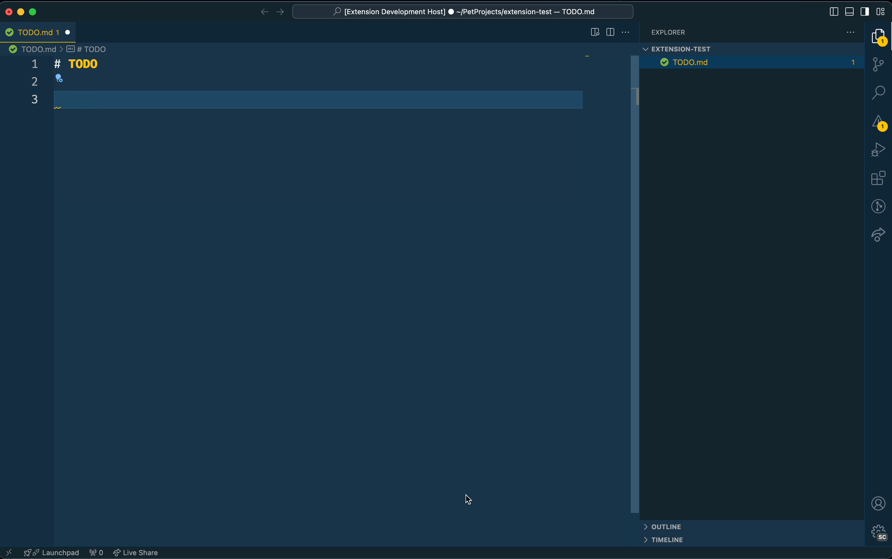
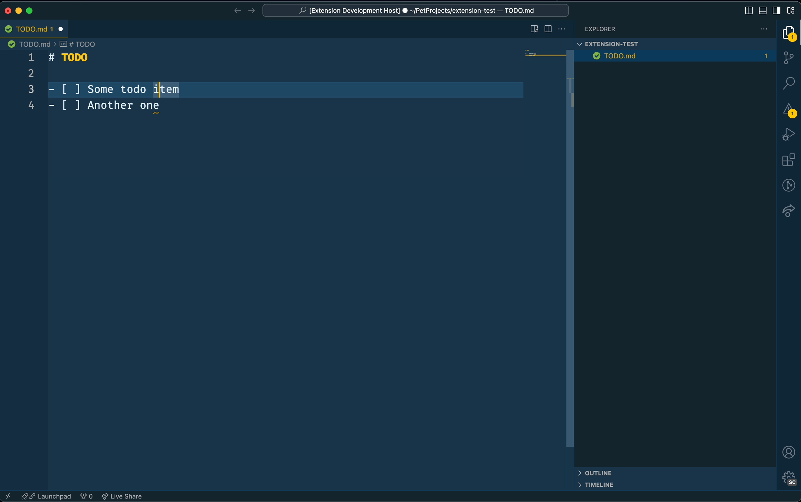
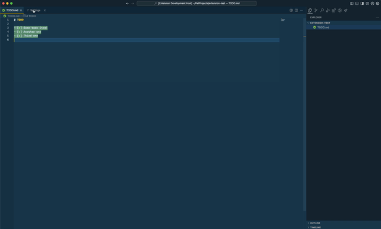

# Simple TODO list

A really simple TODO list extension to manage your list of TODOs from a simple markdown file within your code.

## Features

Using the extension it is possible to create a TODO file, add items to that file and toggle each item on and off.

### Create a TODO file

To create a new TODO file use the Command Pallette(`CMD+SHIFT+P` / `CTRL+SHIFT+P`) and search for `Simple TODO list: Create TODO.md file`. Executing this command will create a new `TODO.md` file in the root of the open project. Note that a folder needs to be open for VS Code to be able to create the file.

### Create a TODO item

There are two options to create a new TODO item in the TODO file.

1. Use the Command Pallette and search for `Simple TODO list: Add a todo item`.

2. Use the shortcut `(CTRL+SHIFT+Y)`

### Toggle a TODO item

There are two options to toggle a TODO item between checked and unchecked states.

1. Use the Command Pallette and search for `Simple TODO list: Toggle a TODO item between checked and unchecked`.

2. Use the shortcut `(CTRL+SHIFT+T)`

## Extension Settings

The look of the checked of items can be customized in two ways, using a ~~strikethrough~~ and a background color.

### Strikethrough

To toggle the strikethrough option on and off, go to the Settings and search for `Simple TODO list` and a checkbox will be available to control the strikethrough option. By default the strikethrough option is `enabled`.

- `simple-todo-list.useStrikeThrough`: A boolean that indicates if the checked items on the TODO list should have a strikethrough or not.

### Background color

An input to control the background color of the checked items in the TODO list. Go to the Settings and search for `Simple TODO list` and an input will be available to control the bacgkround color option. The background color value should be provided in a `HEX format`. By default the background color is set to #57886C but all valid `HEX` colors can be used. If no value is provided, no background color will be applied to checked items.

- `simple-todo-list.backgroundColor`: A HEX value for the background color of checked items, leave empty if no background color should be used.

## Known Issues

- Using other extensions that add highlighting might conflict with this one and create weird behaviour, e.g. [Highlight](https://marketplace.visualstudio.com/items?itemName=fabiospampinato.vscode-highlight)
- `Undo`/`redo` will not trigger highlight changes correctly, workaround is to toggle between TODO.md and another open document.
- When changing the settings of the extension in a split view (having the settings and the TODO.md file open side by side) the highlighting will not change until the TODO.md is opened again.

## Release Notes

### 0.0.1

Initial release of Simple TODO list
